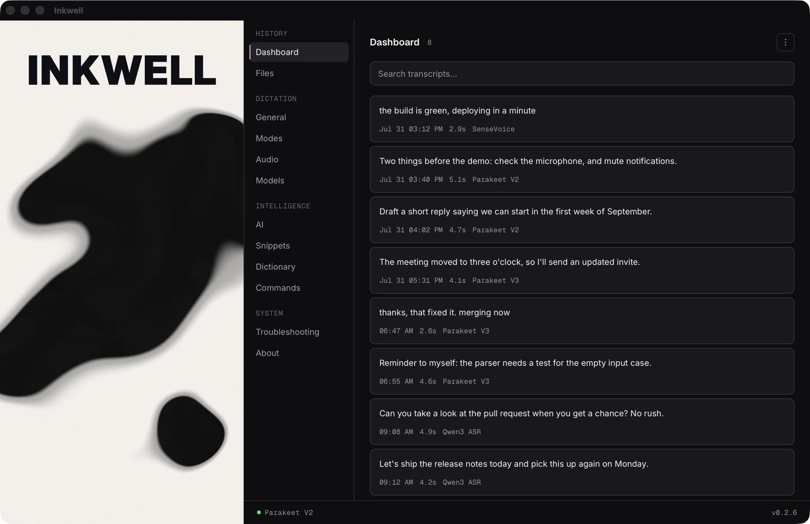
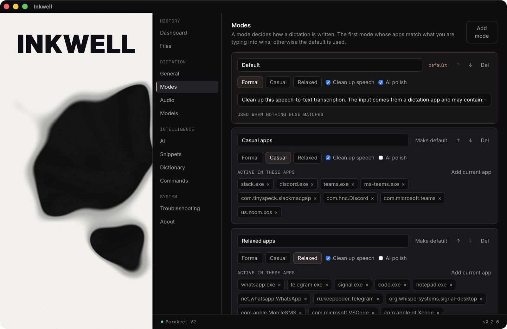
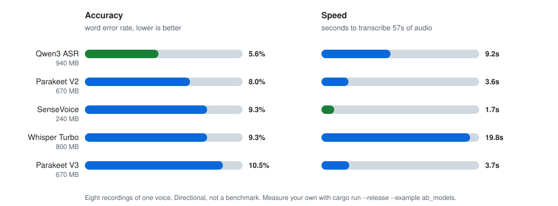
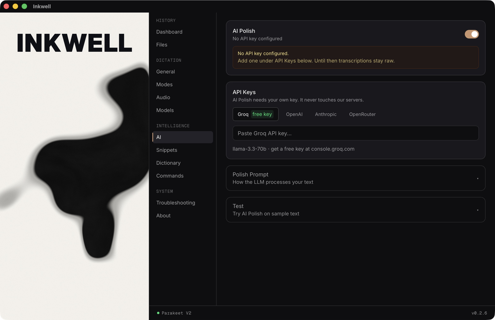

<div align="center">

# Inkwell

**Local-first speech to text for your desktop. Free, open source, no account.**

[](https://github.com/SirSicard/inkwell/releases/latest)
[](https://github.com/SirSicard/inkwell/actions)
[](https://github.com/SirSicard/inkwell/releases)
[](LICENSE)
[](#install)

</div>

**Your voice, your words, your machine.**

Hold a hotkey, speak, release. The text lands in whatever app you were typing in. Speech recognition runs on your own CPU, so your audio never leaves the machine.

Inkwell is free and stays free. MIT licensed, no paid tier, no license keys, no accounts, no telemetry.

<p align="center">
  
</p>

## What it does

- **Dictation anywhere.** Global hotkey, push to talk or toggle. Transcribes, then pastes into the focused app.
- **Local speech recognition.** Five models via [sherpa-onnx](https://github.com/k2-fsa/sherpa-onnx), each answering a different question about your language, disk and patience. Downloaded on first use and switchable in the app. See [Models](#models).
- **Style formatting.** Formal, Casual, Relaxed. Controls capitalization and punctuation without touching a model.
- **Custom dictionary.** Fix the words your model keeps getting wrong. Case insensitive, word boundary matching.
- **Snippets.** Trigger phrases expand to full text. Variables: `{date}`, `{time}`, `{clipboard}`.
- **Voice commands.** Wake prefix plus action, for example "inkwell, scratch that" or "inkwell, formal mode".
- **Modes.** One bundle of style, speech cleanup and AI polish, activated by which app you are typing into. Formal and polished in email, lowercase and unpunctuated in a terminal, without touching a setting. Works on macOS and Windows.
- **File transcription.** Drag in audio or video. MP3, WAV, FLAC, OGG, M4A, MP4, MKV and more.
- **History and export.** SQLite-backed transcript history, searchable and editable. Export TXT, SRT, JSON, CSV.
- **Stats.** Words dictated, speaking time, streak, daily activity and model usage, computed from the history you can see and delete, not from a hidden counter.
- **Tray and overlay.** Lives in the tray. A small always-on-top overlay shows recording state. The hotkey works with the window hidden.
- **Voice editing.** Select text anywhere, hold a second hotkey, say what to change, and the rewrite replaces the selection. Needs an API key.
- **Speech cleanup.** "um", "uh" and immediate stutters removed before the text is pasted, without changing what the sentence says.
- **AI polish (optional, off by default).** Bring your own API key to clean up grammar and false starts. See below.

### Modes, the part that is hard to picture

A mode bundles a writing style, speech cleanup and AI polish, and switches itself on based on which app you are typing into. Formal and polished in email, lowercase and unpunctuated in Slack, without touching a setting. The first mode whose app list matches wins; otherwise the default applies.

<picture>
  
</picture>

## Privacy

- Audio is captured, resampled and transcribed locally. It is never uploaded.
- Transcripts live in a local SQLite file in your app data directory. Nothing syncs.
- There is no telemetry, no analytics, no crash reporting, no account, no server owned by this project that your text passes through.
- **AI polish is the only feature that talks to the internet, and only if you turn it on.** You supply your own API key for OpenAI, Groq, Anthropic, OpenRouter or a custom OpenAI-compatible endpoint. The key is stored in the OS keyring. When polish is on, the transcribed **text** (never the audio) is sent directly from your machine to the provider you chose. Turn it off and Inkwell makes no network calls except model downloads and update checks.
- Earlier builds shipped a free proxy tier that routed polish requests through a server the maintainer paid for. That is gone. BYOK is the only path.

## Install

Builds are on the [Releases page](https://github.com/SirSicard/inkwell/releases). macOS builds are signed with a Developer ID and notarized by Apple, so they open normally. Windows is not signed yet, so SmartScreen still warns there.

### macOS (Apple Silicon, primary platform)

1. Download the `.dmg`, drag Inkwell to Applications, open it. No security warning to click past: the app is signed and notarized.
2. Grant **Microphone** access when prompted (System Settings > Privacy & Security > Microphone).
3. Grant **Accessibility** access (System Settings > Privacy & Security > Accessibility). Inkwell types the result into the focused app with a synthetic paste, which macOS blocks until this is granted. Without it, transcription works but nothing appears.

> [!NOTE]
> Accessibility is the one people miss. Without it dictation transcribes fine and nothing appears, which reads like the app is broken.

Known macOS limitations: synthetic paste is blocked by Secure Input, so dictation into password fields and some terminals will silently do nothing. Per-app style overrides do not work yet.

### Windows (secondary, built in CI)

Download the NSIS installer (recommended) or the MSI.

> [!WARNING]
> Windows builds are not code signed. SmartScreen will block the installer with "Windows protected your PC": click **More info**, then **Run anyway**. Your browser may also flag the download as uncommon. Only macOS is signed today.

### Linux

Best effort. CI produces `.AppImage` and `.deb`. Not regularly tested.

## Quick start

1. Launch Inkwell and finish the short onboarding (mic picker, model download, hotkey test).
2. Pick a model. Parakeet V3 (670 MB) is the default and detects the language for you. If you only dictate in English, switch to Parakeet V2, which is measurably more accurate at the same size. If you want the best accuracy and do not mind a bigger download, take Qwen3 ASR. Models download on first use, they are not inside the installer.
3. Set your record hotkey in Settings > General. On macOS pick a combination that does not collide with Spotlight or input source switching.
4. Hold the hotkey, speak, release. The text is pasted where your cursor is.

## Models

<picture>
  <source media="(prefers-color-scheme: dark)" srcset="docs/media/models-dark.svg">
  
</picture>

| Model | Languages | Pick it when |
|---|---|---|
| **Qwen3 ASR** | 30, incl. Nordic | You want the best accuracy, or you move between English and a Nordic language. The only model here that does not force that choice |
| **Parakeet V3** | 25 European | The default. You switch between European languages, or want it detected for you |
| **Parakeet V2** | English | You only dictate in English. Same download as V3, meaningfully more accurate |
| **SenseVoice** | en, zh, ja, ko, yue | Small disk, slow connection, or an older machine. A quarter of the size and the fastest here, at the same accuracy as Whisper |
| **Whisper Turbo** | 99 | You need a language the others do not reach. Nothing else recommends it |

Word error rates are measured, not quoted: eight recordings of one voice, scored
against what was actually said, with the tool in `src-tauri/examples/ab_models.rs`.
Eight clips is directional, not a benchmark, and your voice is not that voice.
Measure your own with Save Debug Audio and the same tool.

The list is short on purpose. It was thirteen models, most of which lost on
every axis at once, which asked you to research speech recognition before
dictating a sentence.

All models run locally on CPU. No internet is needed once a model is downloaded.

## Voice editing

Select text anywhere, hold the edit hotkey (Cmd+Shift+E on macOS, Ctrl+Shift+E elsewhere), say what to change, and the rewrite replaces the selection. "Make this shorter", "fix the grammar", "turn this into bullet points".

This needs an API key, because rewriting text to order is a language-model job and Inkwell has no model of its own to do it with. Dictation itself stays entirely local and needs no key. Clear the hotkey in General to turn the feature off and free the shortcut.

## Getting a free API key

Voice editing and AI polish are the only features that need one. Groq has a free tier that covers ordinary personal use, needs no credit card, and is fast enough that the rewrite feels instant. It takes about two minutes.

1. Go to **[console.groq.com](https://console.groq.com)** and sign in with Google, GitHub or email.
2. Open **API Keys** in the left sidebar, then **Create API Key**. Name it anything, "Inkwell" is fine.
3. Copy the key **now**. It starts with `gsk_`, and Groq shows it once. If you lose it, delete that key and make another.
4. In Inkwell, open **AI** in the sidebar. Groq is the first tab, marked `free key`.
5. Paste the key into the field and it saves itself. The warning at the top disappears.
6. Turn on the **AI Polish** toggle if you want it applied to ordinary dictation as well. Voice editing works either way.

<picture>
  
</picture>

Your key is stored in the operating system keyring, macOS Keychain or the Windows Credential Manager, never in a config file in plain text. It is sent directly from your machine to the provider you chose. There is no server belonging to this project in the path.

> [!IMPORTANT]
> Dictation never needs a key and never leaves your machine. This is only for the two features that rewrite text. If you skip this section entirely, everything else still works.

Prefer a different provider? OpenAI, Anthropic and OpenRouter are on the same screen, as is any OpenAI-compatible endpoint if you run your own.

## Not built (so you do not have to ask)

- **Streaming / live partial text while you speak.** Not implemented. Transcription starts when you release the hotkey.
- **Speaker diarization, meeting mode, calendar integration.** Not planned.
- **GPU acceleration.** CPU inference only.
- **Voice agent mode.** Removed in this rehaul. It targeted a gateway that no longer exists.
- **Silence trimming (Silero VAD)** downloads its model (`silero_vad.onnx`) on first run. Until that finishes, dictation works but silence is not trimmed, and the app says so rather than failing quietly.


## Support the project

Inkwell is free and will not be paywalled. If it saves you time, you can leave a tip:

> **https://buymeacoffee.com/mattiasherzig**

Suggested: EUR 10. Entirely voluntary, nothing in the app is gated behind it.

Non-financial help is worth more: file a bug, report what breaks on your hardware, or send a PR.

## Build from source

```bash
# Prerequisites: Rust toolchain (rustup.rs), Node.js 20+
# Platform deps: https://v2.tauri.app/start/prerequisites/

git clone https://github.com/SirSicard/inkwell.git
cd inkwell
npm install
cargo tauri dev
```

Rust tests: `cargo test` in `src-tauri`. See [CONTRIBUTING.md](CONTRIBUTING.md) for the codebase layout and [docs/ARCHITECTURE.md](docs/ARCHITECTURE.md) for where the code is heading.

## Stack

Rust + [Tauri v2](https://tauri.app), [sherpa-onnx](https://github.com/k2-fsa/sherpa-onnx) for inference (ONNX Runtime, CPU), [Silero VAD](https://github.com/snakers4/silero-vad), cpal for capture, rubato for resampling, SQLite for history. Frontend is React 19, TypeScript, Tailwind v4, Framer Motion, and a WebGL ink shader.

## Requirements

- macOS on Apple Silicon, Windows 10/11, or a recent Linux desktop
- 2 GB free RAM with Parakeet V3, less with the small models
- Disk: about 50 MB for the app plus the model you choose (240 MB to 940 MB)
- Any microphone

## Contributing

Bug reports and PRs are welcome. Read [CONTRIBUTING.md](CONTRIBUTING.md) first. Security issues go through [SECURITY.md](SECURITY.md), not the public issue tracker.

## License

MIT. See [LICENSE](LICENSE).

## Credits

Built by [Mattias Herzig](https://mattiasherzig.com). Originally based on [Handy](https://github.com/cjpais/Handy) by CJ Pais. Powered by [sherpa-onnx](https://github.com/k2-fsa/sherpa-onnx), [Tauri](https://tauri.app) and [Silero VAD](https://github.com/snakers4/silero-vad).
